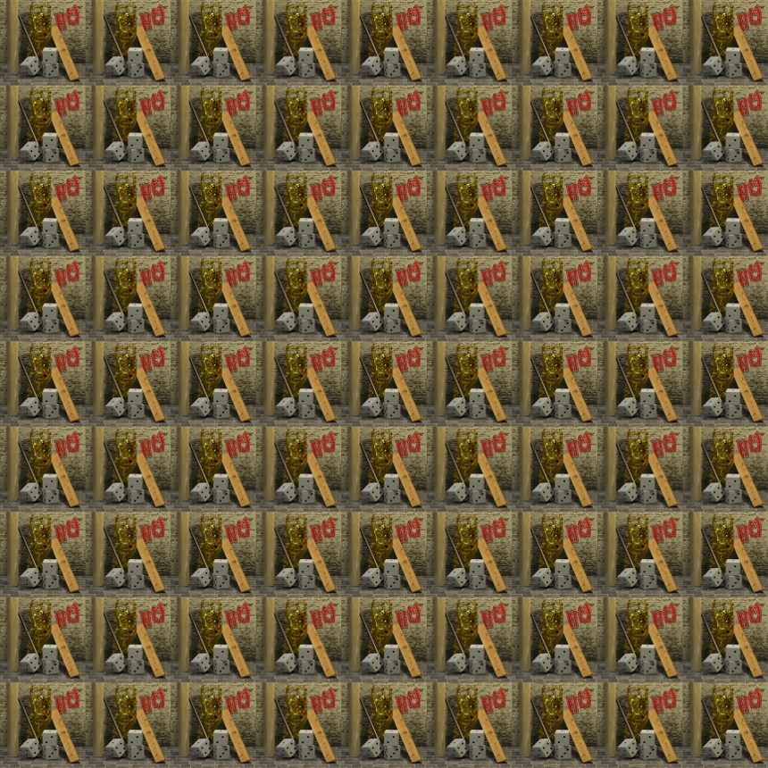
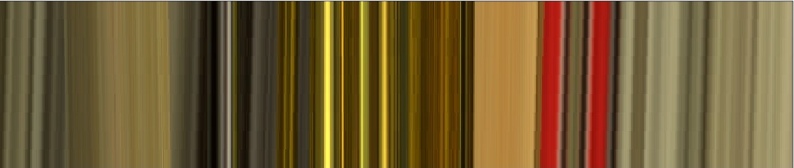
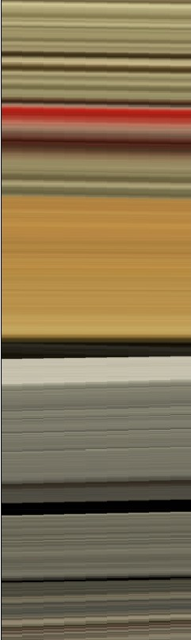
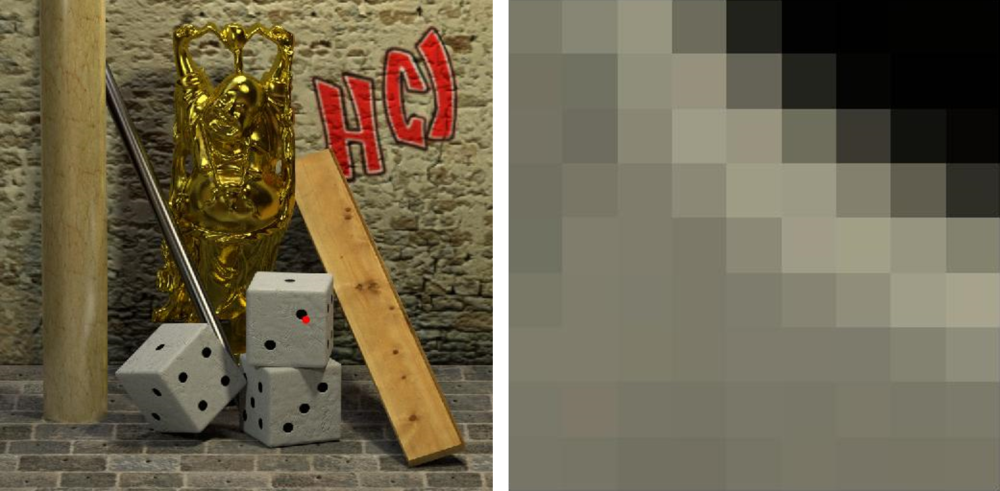

# Lightfield-processing

This is an useful tool to decode lightfield files(.lfp) and process the raw images in to 5D data. You can simplely run [`demo.m`](demo.m) step by step to see the results.

## Step 1: load LF data

Note that if you do not have LF data, please download before. Once you have run `ViewLightField`, you will get the following wonderful images.

## Step 2: Horizontal EPI (fix v & y)

## Step 3: Vertical EPI (fix u & x)

## Step 4: Show Angular Patches(AP)

